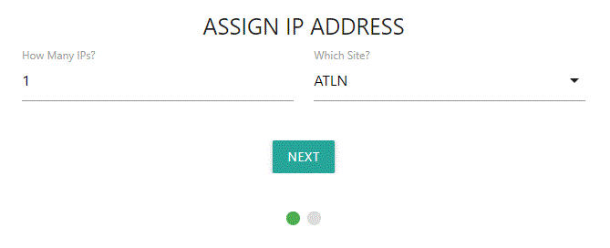
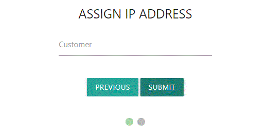

# IP Address ManagER
IPAMer was created to help ISPs manage the assignment of static IP addresses for customers. It's built for front-line people who may or may not have technical knowledge of IPs, subnet masks, gateways, prefixes, etc.

IPAMer is tightly integrated with the NetBox API, and assumes NetBox is the "source of truth" for your IP prefixes and addresses.

# Requirements and IPAMer Install

## Prerequisites
- Linux server
- [git](https://git-scm.com/downloads)
- [Node.js](https://github.com/nodejs/node)
- [NetBox](https://github.com/netbox-community/netbox)

## NetBox Setup

#### NetBox configuration assumptions, for correct functionality of IPAMer
- Prefixes are associated with Sites
- Some Prefixes are set-aside for customer static IPs

#### configuration
- from NetBox admin area, create a user with superuser status
- from NetBox admin area, create an API token for newly created user; and note the token for future use below
- from NetBox admin area, create a custom text field called 'Subnet' for ipam > prefix objects
- from NetBox admin area, create a custom text field called 'Gateway' for ipam > prefix objects
- configure, at a minimum, your Site(s) and Prefix(es) in NetBox
- assign respective sites to their prefixes

#### NetBox prefixes must meet these requirements in order to be used by IPAMer. See below image for example.
- a site assigned
- a tag of 'ipamer_static'

#### the below parameters are technically optional for NetBox prefixes; but they provide vital information for front-line people who are giving static IP info to customers.
- the custom field 'Subnet' filled out
- the custom field 'Gateway' filled out

## These install steps assume you're using a systemd-based Ubuntu distro - adjust accordingly.
    sudo adduser ipamer
    cd /opt
    sudo git clone https://github.com/endeavorcomm/ipamer.git
    cd ipamer
    sudo npm install
    sudo apt install nano
    sudo nano /etc/systemd/system/ipamer.service

#### Paste the following into the ipamer.service file. Then save and exit file.
    [Unit]
    Description=IPAMer
    After=network.target
    
    [Service]
    Type=simple
    User=ipamer
    ExecStart=/usr/bin/node /opt/ipamer/app.js
    WorkingDirectory=/opt/ipamer
    Restart=on-failure
    
    [Install]
    WantedBy=multi-user.target

#### Create environment file
    sudo nano /opt/ipamer/.env

#### Add the following into the .env file, with their proper values; where HOST is the FQDN http(s) of your NetBox site. Then save and exit file.
    NETBOX_API_KEY=
    NETBOX_HOST=
    NODE_PORT=

IPAMer listens on port 8080 by default, but you can change that by declaring a port number in the .env file

#### Finish service setup
    sudo systemctl daemon-reload
    sudo systemctl enable ipamer.service
    sudo systemctl start ipamer.service

# IPAMer Workflow
1. If desired, create a customer first by clicking the 'CREATE CUSTOMER' button on the main page - but this is strictly optional. The only perceived advantage is that you can assign a description to the customer immediately. Customer descriptions can always be done afterward an IP is assigned.
2. Click the 'ASSIGN IP ADDRESS' button on the main page.
3. Follow prompts

#### Things to know:
1. When typing in a customer, existing customers will be suggested in realtime.
2. If the customer name you type on step 2 doesn't exist, IPAMer will create the customer for you during the IP assignment process.

# Contributing
Use the dev branch for contributing. Please create an issue first, then ask that the issue be assigned to you.

# About
Originally developed by [Jason Creviston](http://github.com/jwc-endeavor)