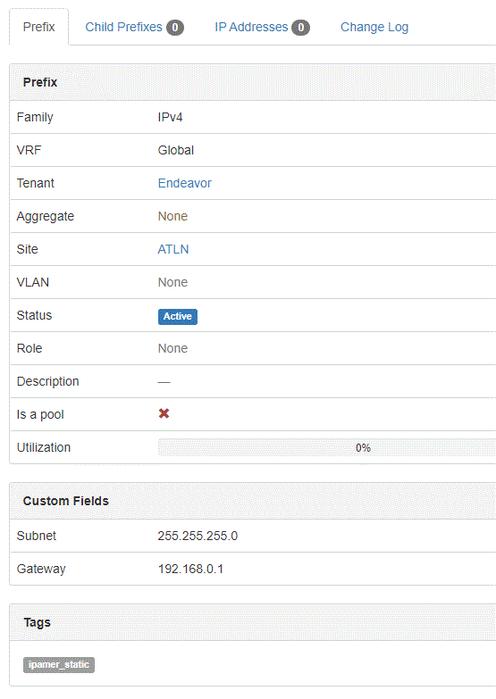

# IP Address ManagER
IPAMer was created to help ISPs manage the assignment of static IP addresses for customers. It's built for front-line people who may or may not have technical knowledge of IPs, subnet masks, gateways, prefixes, etc.

IPAMer is tightly integrated with the NetBox API, and assumes NetBox is the "source of truth" for your IP prefixes and addresses.

# Requirements and IPAMer Install
- [git](https://git-scm.com/downloads)
- [Node.js](https://github.com/nodejs/node)
- [NetBox](https://github.com/netbox-community/netbox)

## These install steps assume you're using an Ubuntu distro - adjust accordingly
    sudo adduser ipamer
    cd /opt
    sudo git clone https://github.com/endeavorcomm/ipamer.git
    cd ipamer
    sudo npm install
    sudo apt install nano
    sudo nano /etc/systemd/system/ipamer.service

#### Paste the following into the ipamer.service file, save and exit file
    [Unit]
    Description=IPAMer
    After=network.target
    
    [Service]
    Type=simple
    User=ipamer
    ExecStart=/usr/bin/node /opt/ipamer/app.js
    WorkingDirectory=/opt/ipamer
    Restart=on-failure
    
    [Install]
    WantedBy=multi-user.target

#### Create environment file
    sudo nano /opt/ipamer/.env

#### Add the following into the .env file, where HOST is the FQDN http(s) of your NetBox site, save and exit file
    NETBOX_API_KEY=
    NETBOX_HOST=
    NODE_PORT=

IPAMer listens on port 8080 by default

#### Finish service setup
    sudo systemctl daemon-reload
    sudo systemctl enable ipamer.service
    sudo systemctl start ipamer.service

# NetBox Setup

- create an API key for an admin user in NetBox
- create a custom field called 'Subnet'
- create a custom field called 'Gateway'
- create a tag called 'static'
- configure, at a minimum, your Site(s), Prefix(es), Address(es) in NetBox

#### NetBox prefixes must meet these requirements in order to be used by IPAMer. See below image for example.
- Site assigned
- Custom field 'Subnet' filled out
- Custom field 'Gateway' filled out
- Tag of 'static'

# IPAMer Workflow
1. If desired, create a customer first by clicking the 'CREATE CUSTOMER' button on the main page - but this is strictly optional. The only advantage is that you can also assign a description to the customer right now. This can always be done afterwards as well.
2. Click the 'ASSIGN IP ADDRESS' button on the main page.
3. Follow prompts

# Contributing
Use the dev branch for contributing. Please create an issue first, then ask that the issue be assigned to you.

# About
Originally developed by [Jason Creviston](http://github.com/jwc-endeavor)